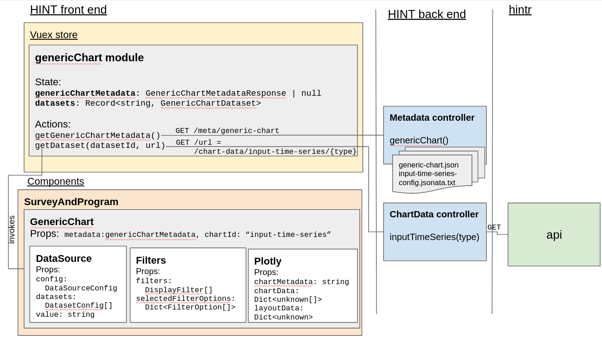
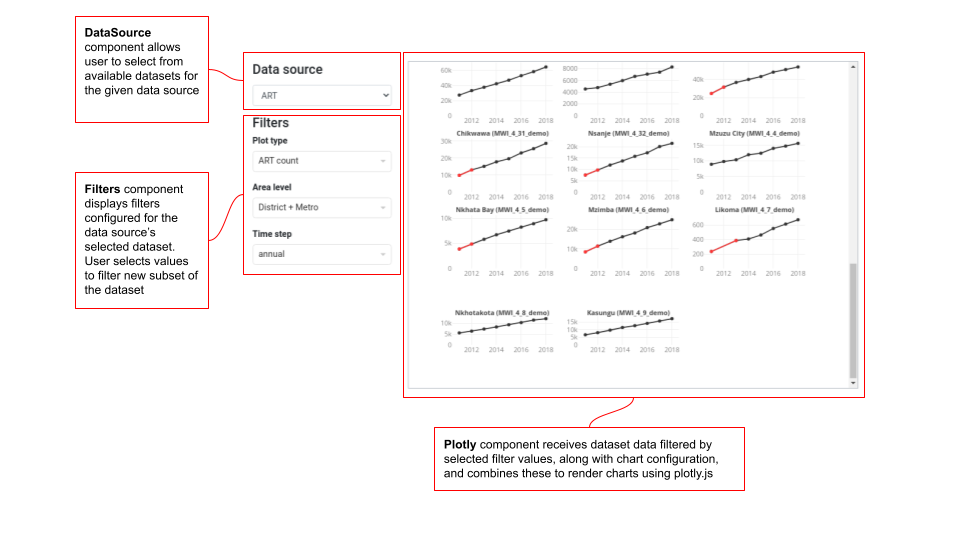

## Generic Chart

HINT has a `GenericChart` vue component in the front end. This is currently only used to display Input Time Series charts - 
however it has been designed to generically accept configuration, chart metadata, and chart data and to display the 
resultant chart using the [Plotly](https://plotly.com/javascript/) library. 

`GenericChart` is intended to be rather self-contained, for example, including its own filter and data source components. 
However it does make use of the store to handle chart data and metadata. This is to avoid the chart needing to re-fetch 
data when it is reloaded.  

Input Time Series, the sole current implementation for Generic Chart, has custom datasets which must be fetched from 
hintr - the url to use is included in the dataset config. However, the chart config could be extended to allow generic 
chart visualisations of the standard input and output datasets in the store.

There is a distinction between *data source* and *dataset* in Generic Chart configuration. A *dataset* refers to some data, 
with the associated url from which to fetch it and an id by which to refer to it. A *data source* configures how data
will fill a role in a particular Generic Chart configuration. For example, a chart might configure two data sources, which 
will provide values to the X and Y axes separately. In the Input Time Series, we have only one data source, 'Data source'.

A data source is fulfilled by a dataset, and configuration defines which datasets should be available for which data sources. In 
Input Time Series, both the ANC and ART datasets are available for 'Data source', and the user selects which to use 
from the data source control. 

This diagram shows the main constituents and data flow involved in showing Generic Chart:
 

This is how they look when rendered in HINT to display the Input Time Series chart:
 

When the app is first loaded, Generic Chart metadata is fetched from the endpoint, and is stored for the duration of the 
front end app. It is stored in `genericChart` state. This metadata consists of a dictionary of chart ids, with 
configuration for each, which instructs the component how to display the chart, including what data sources to use, 
what filters to apply, and a [JSONata](https://jsonata.org/) template describing the plotly configuration to use. See 
[below](#chart-config-jsonata) for further details. 

Generic Chart metadata is currently kept in resource files in the back end of HINT. However we may in future hand over 
this metadata to hintr, and have HINT fetch metadata from hintr as well as data. 

Wherever the `GenericChart component` appears, it is provided with its chart id in a prop, and pulls out the relevant 
section from the metadata. The chart metadata defines urls from which to fetch datasets (e.g. the custom input time series 
datasets) - the component invokes an action on the GenericChart state to retrieve this data when required, and it is 
stored in the GenericChart state along with dataset id. 

Currently, `GenericChart` component is only located in the `SurveyAndProgram component`, on the 'Time series' tab.

GenericChart has these sub-components:
- `DataSource`: used to select a dataset to display in the chart for a given datasource. Selecting a new data set, or loading the 
component with default datasets selected, causes the component to invoke the store to fetch any datasets which have not 
yet been fetched. 
- `Filters`: this is the same Filters component used elsewhere in HINT. There is one Filters component per data source. 
Currently, we use filter options defined in the dataset response itself, as for other datasets in HINT. We could 
potentially customise filters for other applications of GenericChart e.g. some filter options might not be available 
for some charts. 
- `Plotly`: an implementation which combines provided chart data and metadata as a JSONata template to a full plotly 
configuration and loads it using the Plotly library. This is very similar to the Chart component in comet. Minor changes 
from that implementation are that we are using the `newPlot` method instead of `react` to accommodate updates to chart 
height when the number of subplots change due to filter changes (particularly are level), and we are using a more 
lightweight Plotly distribution, plotly-js.basic-dist.

### Generic Chart Metadata

The Generic Chart Metadata consists of a dictionary of `GenericChartMetadata` objects, whose keys are the chart ids. 
Here is an annotated example of GenericChartMetadata:
```
{
      // This section configures the datasets available to the charts, and where to get them from
      "datasets": [  
        {
          // id by which chart will identify dataset - the id used in the dict of datasets in the store
          "id": "art",  

          // translation key of label to display for the option for this dataset in the Data source component
          "label": "ART",  

          // endpoint from which to fetch this dataset
          "url": "/chart-data/input-time-series/programme",

	  // which filters to display for this dataset, and where to get their metadata (i.e. their filter options). 
	  // "data" is the only currently supported option i.e. get the filters from the metadata property dataset itself	
          "filters": [ 
            {
              "id": "plot_type",
              "source": "data"
            },
            {
              "id": "area_level",
              "source": "data"
            },
            {
              "id": "time_step",
              "source": "data"
            }
          ]
        },
        {
          "id": "anc",
          "label": "ANC",
          "url": "/chart-data/input-time-series/anc",
          "filters": [
            {
              "id": "plot_type",
              "source": "data"
            },
            {
              "id": "area_level",
              "source": "data"
            },
            {
              "id": "age",
              "source": "data"
            }
          ]
        }
      ],
      "dataSelectors": {
	// Data source is currently the only type of data selector supported.
	// A data source has a particular role in the chart. The user selects which dataset to use for each data source. 
        "dataSources": [
          {
            // Id for this data source
            "id": "data",

	    // A data source might not be editable if only one dataset was available
            "type": "editable", 

            // Translation key for the label to use for the data source selector		
            "label": "dataSource",  

	    // Default dataset id to use for the data source		
            "datasetId": "art",

	    // Will be used to show or hide controls for user to select indicator (not yet implemented)
            "showIndicators": false,

	    // Show or hide controls for user to select filter values
            "showFilters": true
          }
        ]
      },
      // Subplot configuration for the chart, if any. Used by GenericChart component to calculate the scroll height area.
      "subplots": {
	// Number of subplots to display per row
        "columns": 3,

	// The column in the data for which a subplot will be shown for each distinct value. 
        "distinctColumn": "area_name",

	// Height in pixels which should be allowed for each row of subplts.
        "heightPerRow": 140
      },
      // This is an array as a future implementation may allow multiple chart types per chart e.g. scatter and bar. 
      // Only one chart config per chart is currently supported		
      "chartConfig": [
        {
          "id": "scatter",

	  // When implemented, this is the translation key for the label to be displayed for this chart type's option 	
          "label": "Scatter",
		
          "config": "...The JSONata config string goes here - see below for more details on this..."
        }
      ]
    }

```

### Chart Config Jsonata

Chart configuration is defined using [JSONata](https://jsonata.org/), a generic json transformation language - at runtime, the `Plotly`
component invokes the transformation on the filtered chart data given the chart configuration JSONata to provide the 
full Plotly chart configuration.

The full Jsonata for the Input Time Series can be found 
[here](https://github.com/mrc-ide/hint/blob/mrc-2537/src/app/src/main/resources/metadata/input-time-series-config-jsonata.txt),

Some explanation for the parts which may not be self-explanatory:

```
$areaNames := $distinct(data.area_name);
```
This sets a [variable](https://docs.jsonata.org/programming#variables) value, allowing a value to be reused without 
needing to be recalculated. Note that the expression setting the variable value must be followed by a semicolon, and 
that this expression, together with the following expressions providing the jsonata output must be contained in 
parentheses. This variable contains the distinct area names in the input data. The same technique is used in a few other places, 
including for `$areaData`, to filter data to the current area.

```
$subplotHeight := 1/subplots.rows * 0.6;
```
Calculate the height of a subplot row, as a fraction of the total plot height, given the number of rows, and including 
40% spacing. 

```
$map($areaNames, function($v, $i) {..}[].*
```
This uses the [map](https://docs.jsonata.org/higher-order-functions#map) function to map the area names to a new array, 
to contain the scatter traces forming the subplots. The first item returned from the map function is the main (black) 
trace containing all data points, the second is the highlighted (red) trace containing only those line segments 
representing a greater than 25% increase or decrease. `$v` is the value in the source array, `$i` is the index.

The final `[].*` first ensures that the result is an array (it is not if the input array has length 1), then flattens 
out the array of arrays returned by the map function to a single array containing all traces 
(since each iteration of the map function returns an array containing its two traces - can't track down the docs for this,
 but referenced in second answer [here](https://stackoverflow.com/questions/49570172/jsonata-query-to-flatten-array-of-arrays)).

```
"xaxis": 'x' & ($i+1),
"yaxis": 'y' & ($i+1),
```

This defines for each subplot which axes it should use. `Plotly` will interpret these values together with the `grid` 
config to draw the traces on subplots arranged on a grid with the configured number of rows and columns. `&` does 
string [concatenation](https://docs.jsonata.org/other-operators#-concatenation) in jsonata, and `($i+1)` ensures that 
axis indexes start from 1.

```
"y": $map(data[area_name=$v].value, function($thv, $thi) {
   (($thi > 0) and $thv > (1.25 * ($areaData.value)[$thi-1]))
   or
   (($thi < $count($areaData.value)-1) and (($areaData.value)[$thi+1] > (1.25 * $thv)))
   or
   (($thi > 0) and $thv < (0.75 * ($areaData.value)[$thi-1]))
   or
   (($thi < $count($areaData.value)-1) and ($areaData.value)[$thi+1] < (0.75 * $thv))
   ? $thv : null
})
```
This code selects how to draw the highlight trace, by mapping each value for the area to either that value (to include 
it in the trace) or null (to exclude it) based on whether it is at the end or the start of a greater than 25% increase 
(the first two clauses), or at the end of the start (the second two clauses) of a greater than 25% decrease.
This uses JSONata's [ternary operator](https://docs.jsonata.org/other-operators#--conditional) and the `and` and `or` 
[boolean operators](https://docs.jsonata.org/boolean-operators).


```
`"annotations": $map($areaNames, function($v, $i) {
  {
  "text": $v & " (" & (data[area_name=$v].area_id)[0] & ")",
  "textfont": {},
  "showarrow": false,
  "x": 0.5,
  "xanchor": "middle",
  "xref": "x" & ($i+1) & " domain",
  "y": 1.1,
  "yanchor": "middle",
  "yref": "y" & ($i+1) & " domain"
  }
})[]
```

We use annotations to add titles to the subplots, as this is the only means Plotly supports. This uses the area names 
and corresponding area ids to make the text of the title, uses the 'x1', 'y1' etc axis identifiers to specify the domain 
in which to place the annotation (`xref` and `yref`) and uses the `x`, `y`, `xanchor` and `yanchor` values to place the 
annotations within the domains.

```
layout": $merge(..)[]
```
This indicates that the `layout` will be constructed by [merging](https://docs.jsonata.org/object-functions#merge) the 
object contained in the parameter array into a single object. This is required because we need to add layout keys for 
each of the axes, to set some axis parameters, as indicated by:
`[1..$count($areaNames)]{`
which maps the numeric range of subplots to objects, each containing the required x and y axis values.

```
"domain": [
    1 - ($row/$$.subplots.rows),
    1 - (($row/$$.subplots.rows) + $subplotHeight)
]
```  
This calculates the domain of each y axis as a two-element array, where the first element is the distance to the top of
the axis from the bottom of the entire plot area, as a fraction of the total plot height, and the second element is the
distance to the bottom of the axis from the bottom of the entire plot area, as a fraction of the total plot height.

### GenericChart component logic

In order to provide its child components with the data and metadata they need, GenericChart computes the following properties:

#### chartMetadata

This selects the chartMetadata config object (described [above](#generic-chart-metadata)) for the `chartId` prop out of 
the store's metadata response.

#### chartConfigValues

This assembles configuration values and selections into a form in which child components can use them as props. These are:
- **dataSourceConfigValues**: Information about data sources' metadata and current selections, and about their associated filters. 
- **layoutData**: Special data which `Plotly` will include with the chart data to instruct plotly on how to layout the chart. This
includes subplots configuration. 
- **scrollHeight**: The height of the scrollable area which `Plotly` should give to the chart area, calculated from the number
of rows and configured height per row. 
- **chartConfig**: string containing the JSONata config for the chart, provided to `Plotly`

#### chartData

The chart data to be provided to `Plotly`, found by taking the selected dataset(s) and applying filter selections to them.

### Front end data types

The following  data types are used to support generic chart configuration:

#### GenericChartMetadata

A dictionary of these objects make up the `GenericChartMetadataResponse`. Their structure is described [above](#generic-chart-metadata)).
This type is defined in `types.ts` and contains props with these sub-types:
- `DataSetConfig`
- `DataSourceConfig`

#### ChartConfigValues

This type defines the `chartConfigValues` built in the `GenericChart` component, which it provides to its child components. 
This type is defined in `GenericChart.vue` and contains a prop with subtype `DataSourceConfigValues`.

#### DataSourceConfigValues

This type defines the config values for a single data source, and includes:
- `DataSourceSelections`
- `DataSourceConfig`
- `DisplayFilter` - the standard type defining filter metadata, used elsewhere in HINT

#### DataSourceSelections

This type defines the selected datasetId and filter selections for a single data source. 
